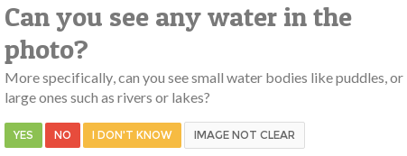
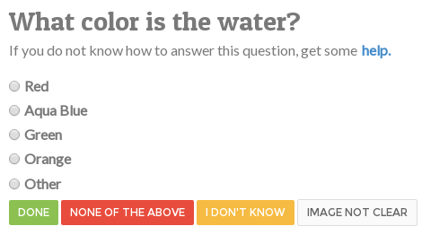
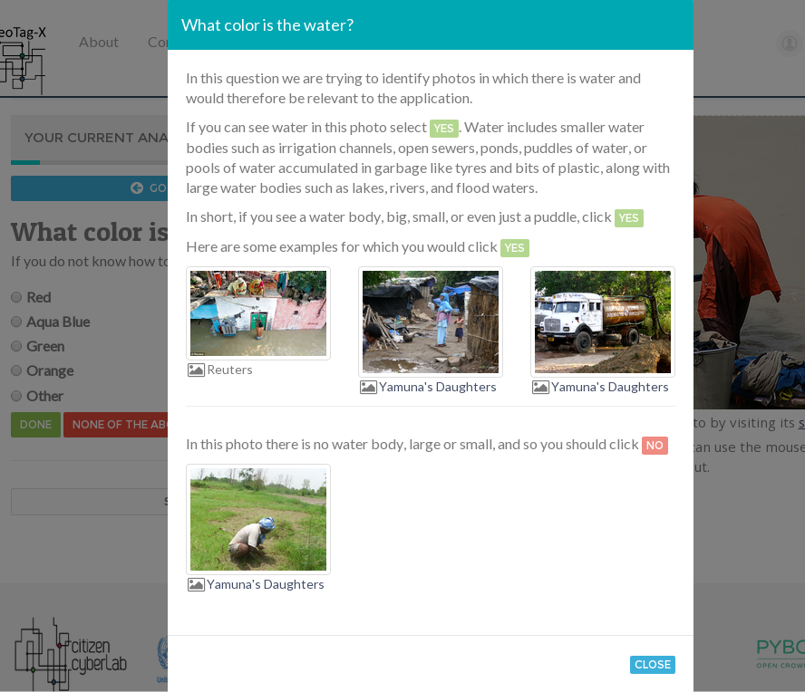

# Building your GeoTag-X project

To build your project using the builder tool, we have added a few more
requirements that you will need to specify in your project configuration. We
have also added the possibility of defining a tutorial configuration that allows
you to create one or more tutorials to complement your project.

Both of the aforementioned configurations can be written in either **JSON** or
**YAML** formats although to keep things simple, the examples in this guide
use the JSON format. As a matter of fact, the examples used in this guide are
taken from the [sample project's](https://github.com/geotagx/geotagx-project-sample/)
JSON configurations.


## I. The project configuration (project.json/project.yaml)

The project configuration -- based on the classic PyBossa configuration -- has
been extended to include a few requirements to help create a project's task presenter.
In addition to the `name`, `short_name` and `description` fields required in all
PyBossa projects, you will need to specify the following fields:
- `why`: a reminder to volunteers about the importance of their contribution to the project.
- `questionnaire`: a list of at least one or more questions asked to volunteers.


### I.1. Questionnaires

The `questionnaire` is a list of entries where each is comprised of
- a unique `key` to identify each entry
- the `type` of question to ask
- the actual `question` to ask
- a short `hint` about the question
- a set of `parameters` that configure the entry's behavior
- a `branch` field to determine the questionnaire's control flow

Please note that the `key`, `type` and `question` fields are mandatory, while
the rest are optional.

#### I.1.a. Keys

A key is a non-empty string that identifies each questionnaire entry. It is
composed of alphanumeric characters, dashes, and/or underscores; and no
whitespace.

A key is used in the following ways:
- The flow in a questionnaire is not necessarily linear. It is possible to jump
from question to question based on specific criteria. To jump to a specific
question, you will need to know its key.
- A help file can be created to elaborate upon a question. Its filename must be
identical to the key for the the question you wish to explain.
- The results to each question is mapped to the question's key.

Please note that certain keywords are reserved for internal use by the project
builder and can not be used as keys. The builder will notify you in these cases.


#### I.1.b. Help

To help volunteers answer questions as accurately as possible, you can either
provide a short hint or a more elaborate explanation for questions that may be
open to interpretation.

A hint is usually a concise way to quickly dispel ambiguity. For instance,
the first questionnaire entry in the sample project
```
{
	"key":"isWaterVisible",
	"type":"binary",
	"question":"Can you see any water in the photo?",
	"hint":"More specifically, can you see small water bodies like puddles, or large ones such as rivers or lakes?",
	"branch":{
		"yes":"waterColor",
		"no":"end"
	}
}
```

will generate the following



Some questions may require more than a hint to get the point across in
which case you will need to create an HTML file in the project's `help` directory.
Note that if this directory does not exist, then it will need to be created first.
The help file's filename must match the `key` to the question you would like to
explain. For example, a question with the key `waterColor` will look for a help
file named `waterColor.html` in the `help` directory.



Wait, where did the help go? That's right, the help is presented to a volunteer
only when it is requested. Since the help can be as long as you would like it to
be, it is instead presented to the user in the form of a modal.




#### I.1.c. Input types and parameters

### Binary input
```
type:binary
```

### Dropdown lists
```
type:dropdown-list
parameters:{
	options:array,
	prompt:string,
	size:number
}
```

### Single-choice input
```
type:select
parameters:{
	options:array
}
```

### Check lists
```
type:checklist
parameters:{
	options:array,
	size:number
}
```

### Illustrative check lists
```
type:illustrative-checklist
parameters:{
	options:array
}
```

### Short text input
```
type:text
parameters:{
	placeholder:string,
	maxlength:number
}
```

### Long text input
```
type:longtext
parameters:{
	placeholder:string,
	maxlength:number
}
```

### Number input
```
type:number
parameters:{
	placeholder:string,
	min:number,
	max:number,
	maxlength:number
}
```

### Date and time input
```
type:datetime
parameters:{
	mindate:string,
	maxdate:string,
	mintime:string,
	maxtime:string
}
```

### Date input
```
type:date
parameters:{
	min:string,
	max:string
}
```

### URL input
```
type:url
parameters:{
	placeholder:string,
	maxlength:number
}
```

### Geotagging input
```
type:geotagging
parameters:{
	location:string
}
```

#### I.1.d. Control flow


## II. The tutorial configuration (tutorial.json/tutorial.yaml)

Project tutorials are a great way of introducing volunteers to your project and
while optional, it is highly recommended that you include one in your project.

The tutorial configuration is comprised of one or more tutorials where each one
contains the following fields:
- `image`: a direct link to an image to analyse.
- `image_source`: a link to a web page that provides contextual information about `image`.
- `assertions`: a set of assertions about `image`.
